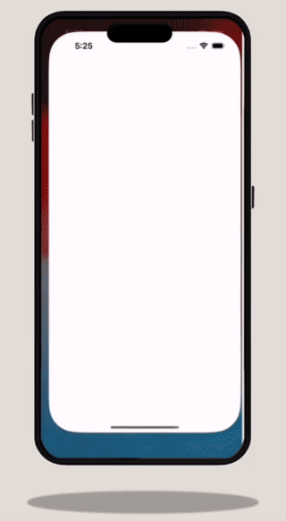

# Weather App

The Weather App is a sophisticated weather forecasting application developed using Flutter. This app provides real-time weather information, including temperature, humidity, wind speed, and more, for any city around the globe. It's an excellent example of a modern, mobile weather application with a sleek and user-friendly interface.

## Table of Contents

- [Installation](#installation)
- [Usage](#usage)
- [Features](#features)
- [Dependencies](#dependencies)
- [Configuration](#configuration)
- [Documentation](#documentation)
- [Troubleshooting](#troubleshooting)
- [Contributors](#contributors)
- [License](#license)

## Installation

To install the Weather App, follow these steps:

1. Clone the repository to your local machine.
2. Ensure you have Flutter installed on your system.
3. Navigate to the project directory and execute `flutter pub get` to install the necessary dependencies.

## Usage

To use the app:

1. Run the app on your preferred device or emulator using `flutter run`.
2. Make sure an emulator is running or a device is connected to your machine.

## Features

Weather App includes several features such as:

- **Real-time Weather Data**: Get up-to-date weather information for any location.
- **City Search**: Search and view weather details for different cities.
- **Weather Conditions Display**: Shows temperature, humidity, wind speed, visibility, and more.
- **Animated Transitions**: Smooth and visually appealing transitions.
- **Interactive UI**: User-friendly interface with intuitive navigation and controls.

## Dependencies

The app relies on the following Flutter dependencies:

- `flutter` (Flutter SDK)
- `material` (Flutter Material Components)
- `lottie` (For animations)
- `weather_icons` (To display weather-related icons)

## Configuration

No additional configuration is required to run the app in its current state.

## Documentation

The project's codebase includes inline comments for clarity and understanding of the functionality.

## Troubleshooting

For issues related to Flutter setup or dependency problems, consult the official Flutter documentation. Ensure that all dependencies are correctly installed and up to date.

## Contributors

This project is developed by [Your Name]. Feel free to contribute, suggest improvements, or report issues.

## License

This Weather App is open-sourced software licensed under the [MIT License](https://opensource.org/licenses/MIT).
